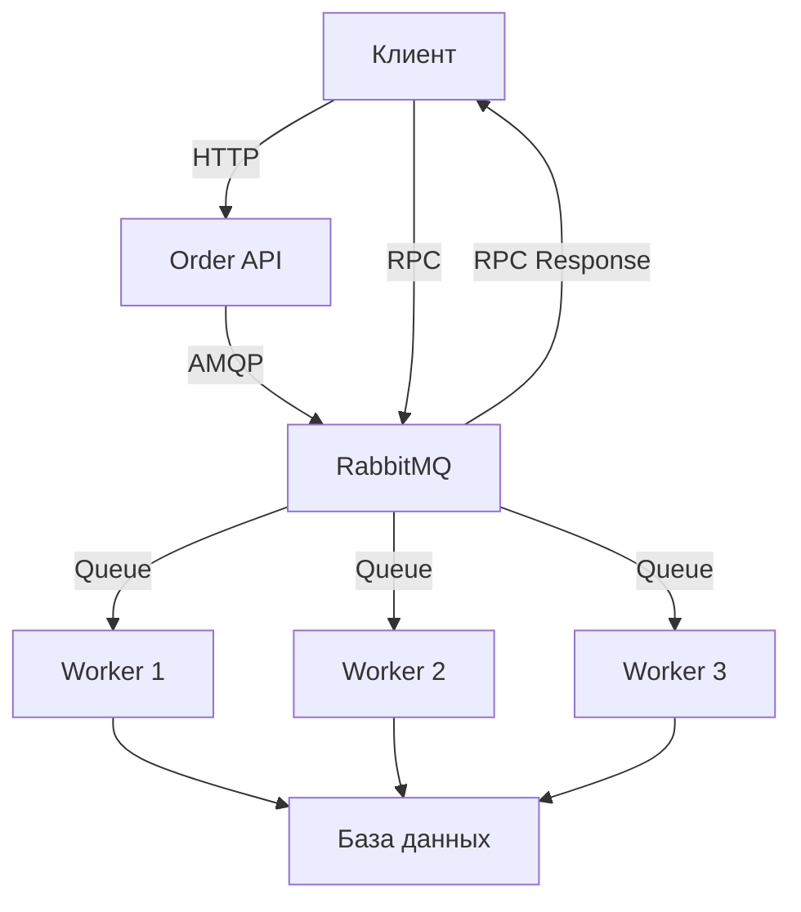

# PyRabbitMQService
Микросервисы на RabbitMQ, демонстрация возможностей

[](https://python.org)
[](https://rabbitmq.com)
[](LICENSE)
[](tests/)

Производственная система обработки заказов с использованием RabbitMQ, демонстрирующая лучшие практики работы с message broker в Python. В коде намеренно много комментариев и уточнений, чтоб было понятно, что там вообще происходит.


# 🎯 Цель проекта

Этот учебный проект демонстрирует реальное использование RabbitMQ для:

- **Асинхронной обработки** заказов с распределением нагрузки
- **Отказоустойчивости** и автоматических повторных попыток
- **Масштабируемости** через добавление воркеров
- **RPC (Remote Procedure Call)** для запросов статуса
- **Сохраняемости** сообщений при перезапусках


# 🏗️ Архитектура




# 📦 Основные компоненты

### 🗃️ Модели данных (`models.py`)
- **Order**: Модель заказа с статусами (PENDING, PROCESSING, COMPLETED, FAILED)
- **OrderStatus**: Enum для типобезопасного управления статусами
- **База данных**: SQLite с SQLAlchemy ORM

### 📤 Продюсер (`producer.py`)
- **OrderProducer**: Отправка заказов в RabbitMQ
- **RPC клиент**: Запросы статуса заказов
- **Сохранение сообщений**: Гарантированная доставка

### 📥 Консьюмер (`consumer.py`)
- **OrderConsumer**: Обработка сообщений из очереди
- **RPC сервер**: Ответы на запросы статуса
- **Обработка ошибок**: Повторные попытки и dead letter handling

### 🌐 API слой (`api.py`)
- **RESTful API**: CRUD операции для заказов
- **Flask**: Легковесный веб-фреймворк
- **Интеграция**: Связь между HTTP и AMQP

### 🧪 Тесты (`test_rabbitmq_system.py`)
- **Unit тесты**: Тестирование отдельных компонентов
- **Интеграционные тесты**: Проверка работы системы целиком
- **Нагрузочное тестирование**: Тестирование производительности


# 🚀 Быстрый старт

### Предварительные требования

- Python 3.8+
- Docker и Docker Compose
- Git

### 1. Клонирование репозитория

```bash
git clone https://github.com/artemmj/PyRabbitMQService.git
cd PyRabbitMQService
```

### 2. Настройка окружения

```bash
# Создание виртуального окружения
python -m venv venv

# Активация (Linux/Mac)
source venv/bin/activate

# Активация (Windows)
venv\Scripts\activate

# Установка зависимостей
pip install -r requirements.txt
```

### 3. Запуск RabbitMQ

```bash
# Запуск RabbitMQ с management plugin
# Тут необходимо либо поставить сам RabbitMQ в ваш дистрибутив/windows/macos, либо поднять рядом в докере
```

### 4. Инициализация базы данных

```bash
python -c "
from models import Base, engine
Base.metadata.create_all(engine)
print('Database initialized successfully')
"
```

### 5. Запуск системы

```bash
# Terminal 1 - Запуск воркеров (обработка заказов)
python run_workers.py

# Terminal 2 - Запуск API сервера
python api.py

# Terminal 3 - Генерация тестовых данных
python generate_data.py
```

# ⚙️ Конфигурация

Система настраивается через переменные окружения:

```bash
# RabbitMQ настройки
export RABBITMQ_HOST=localhost
export RABBITMQ_PORT=5672
export RABBITMQ_USER=guest
export RABBITMQ_PASS=guest

# База данных
export DATABASE_URL=sqlite:///orders.db

# Настройки воркеров
export MAX_RETRIES=3
export PROCESSING_TIME=2
```

Или через редактирование `config.py`:

```python
class Config:
    RABBITMQ_HOST = 'localhost'
    RABBITMQ_PORT = 5672
    # ... другие настройки
```


# 🔧 Использование

### Создание заказа через API

```bash
curl -X POST http://localhost:5000/orders \
  -H "Content-Type: application/json" \
  -d '{
    "customer_name": "John Doe",
    "product": "Laptop",
    "quantity": 1,
    "amount": 999.99
  }'
```

### Получение статуса заказа

```bash
curl http://localhost:5000/orders/1
```

### Просмотр всех заказов

```bash
curl http://localhost:5000/orders
```

### Генерация тестовых данных

```bash
# Генерация 100 заказов
python generate_data.py

# Генерация определенного количества
python generate_data.py --count 500
```

# 🧪 Тестирование

### Запуск unit тестов

```bash
# Все тесты
pytest test_rabbitmq_system.py -v

# Конкретный тест
pytest test_rabbitmq_system.py::test_order_creation_and_processing -v

# С покрытием кода
pytest --cov=. test_rabbitmq_system.py
```

### Запуск интеграционных тестов

```bash
# Предварительно запустите RabbitMQ и воркеры
docker-compose up -d
python run_workers.py &

# Запуск интеграционных тестов
pytest test_rabbitmq_system.py::test_load_balancing -v
```

### Нагрузочное тестирование

```bash
# Запуск стресс-теста (1000 заказов, 5 воркеров)
python stress_test.py

# Кастомная конфигурация
python stress_test.py --orders 2000 --workers 10
```

### Тестирование отказоустойчивости

```bash
# 1. Запустите систему
python run_workers.py &
python api.py &

# 2. Создайте заказы
python generate_data.py --count 50

# 3. Остановите одного воркера (Ctrl+C)
# 4. Наблюдайте автоматическое перераспределение нагрузки
```


# 📊 Мониторинг

### RabbitMQ Management Console

Откройте в браузере: http://localhost:15672

Логин: `guest`
Пароль: `guest`

**Что мониторить:**
- 📊 **Queues**: Количество сообщений в очередях
- ⚡ **Message rates**: Скорость обработки сообщений
- 🔄 **Channels**: Активные подключения
- ❌ **Error rates**: Количество ошибок

### Мониторинг базы данных

```bash
# Просмотр всех заказов
sqlite3 orders.db "SELECT * FROM orders;"

# Статистика по статусам
sqlite3 orders.db "SELECT status, COUNT(*) FROM orders GROUP BY status;"

# Время обработки
sqlite3 orders.db "SELECT 
  MIN(created_at) as first_order,
  MAX(updated_at) as last_processed,
  COUNT(*) as total_orders,
  SUM(CASE WHEN status = 'completed' THEN 1 ELSE 0 END) as completed
FROM orders;"
```


# 🐛 Отладка

### Включение debug логов

```python
# В config.py добавьте
import logging
logging.basicConfig(level=logging.DEBUG)
```

### Просмотр логов RabbitMQ

```bash
docker-compose logs rabbitmq
```

### Тестирование подключения

```bash
# Проверка подключения к RabbitMQ
python -c "
import pika
connection = pika.BlockingConnection(
    pika.ConnectionParameters('localhost')
)
print('RabbitMQ connection successful')
connection.close()
"
```
